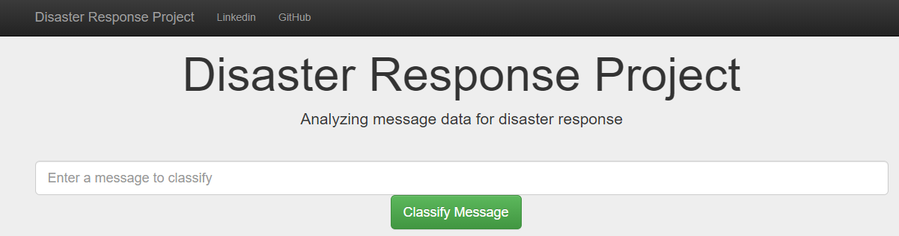

# Disaster Response Project

### Table of Contents
1. [Installation](#installation)
2. [Project Overview](#project)
3. [File Description](#file)
4. [Visualizations](#image)
5. [Licensing, Authors, and Acknowledgements](#license)

## Installation 

All the librarires required to run the code are mentioned in [requirements.txt](https://github.com/rahul385/disaster-response-web-application/blob/master/requirements.txt).

To install Run: `pip install -r requirements.txt`

## Project Overview 
The objective of this Machine Learning project is to analyze thousands of real messages sent during natural disasters either via social media or directly to disaster response organizations. 

Below is the link to web application that I have deployed on Heroku.
[Disaster Resposne Web-Application](https://webapp-flask-disaster-response.herokuapp.com/)

Machine learning is critical to helping different disaster response organizations understand which messages are relevant to them and which messages to prioritize. During these disasters is when they have the least capacity to filter out messages that matter, and find basic methods such as using key word searches to provide trivial results. This disaster response pipeline will classify those text messages into several categories which can easily be monitored by respective disaster management organizations.

## File Description 

* **data**: This folder contains real messages received during a natural disaster in csv format.
    * `disaster_categories.csv`
    * `disaster_messages.csv`
    * `process_data.py` : This python module takes csv files as input containing messages and categories (labels), cleans and processes the data and then exports it into a database table.
    * `DisasterResponse.db` : The database file generated and saved after running python module "process_data.py"
    
* **models**: This folder contains real messages received during a natural disaster in csv format.
    * `train_classifier.py` : This file imports the data from database table and trains a Machine Learnin model to classify messages among 36 different categories.
    * `classifier.pkl` : The model generated and saved after running python module "train_classifier.py"
    * `utils.py` : Python module to clean, normalize and tokenize the text.

* **templates**: This folder contains real messages received during a natural disaster in csv format.
    * `go.html`
    * `master.html`

* **Visualizations**: This folder contains the images generated as part of analysis. These images are also displayed in the web application deployed on Heroku. 
    * `Message_Count_By_Category.PNG`
    * `Message_Count_By_Genre.PNG`

* **ETL Pipeline Preparation.ipynb**:  Jupyter notebook for process_data.py

* **ML Pipeline Preparation.ipynb**: Jupyter notebook for train_classifier.py

* **utils.py**: Python module to clean, normalize and tokenize the text.

* **run.py**: Main python module contains the entire executionflow and also renders visualizations on html.

### Instructions:
1. Run the following commands in the project's root directory to set up your database and model.

    - To run ETL pipeline that cleans data and stores in database
        `python data/process_data.py data/disaster_messages.csv data/disaster_categories.csv data/DisasterResponse.db`
    - To run ML pipeline that trains classifier and saves the model
        `python models/train_classifier.py data/DisasterResponse.db models/classifier.pkl`

2. Run the following command in the app's directory to run your web app.
    `python run.py`

3. The web application deployed on Heroku can be accessed through the below URL

https://webapp-flask-disaster-response.herokuapp.com/

## Screenshots 

***Screenshot 1: Message Count by Category***

***Screenshot 2: Message Count by Genre***

## Licensing, Authors, Acknowledgements 
This web application was developed as part of the [Udacity Data Scientist Nanodegree](https://www.udacity.com/course/data-scientist-nanodegree--nd025).

Author: Rahul Gupta Copyright 2020

Permission is hereby granted, free of charge, to any person obtaining a copy of this software and associated documentation files (the "Software"), to deal in the Software without restriction, including without limitation the rights to use, copy, modify, merge, publish, distribute, sublicense, and/or sell copies of the Software, and to permit persons to whom the Software is furnished to do so, subject to the following conditions:

The above copyright notice and this permission notice shall be included in all copies or substantial portions of the Software.

THE SOFTWARE IS PROVIDED "AS IS", WITHOUT WARRANTY OF ANY KIND, EXPRESS OR IMPLIED, INCLUDING BUT NOT LIMITED TO THE WARRANTIES OF MERCHANTABILITY, FITNESS FOR A PARTICULAR PURPOSE AND NONINFRINGEMENT. IN NO EVENT SHALL THE AUTHORS OR COPYRIGHT HOLDERS BE LIABLE FOR ANY CLAIM, DAMAGES OR OTHER LIABILITY, WHETHER IN AN ACTION OF CONTRACT, TORT OR OTHERWISE, ARISING FROM, OUT OF OR IN CONNECTION WITH THE SOFTWARE OR THE USE OR OTHER DEALINGS IN THE SOFTWARE.
